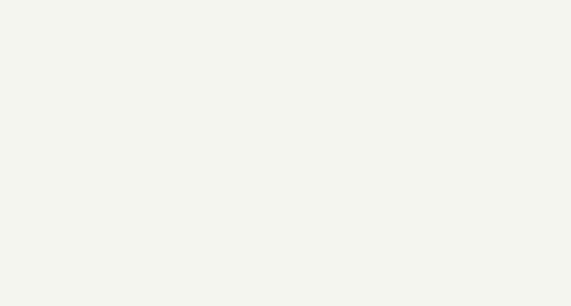
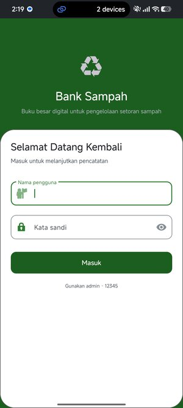
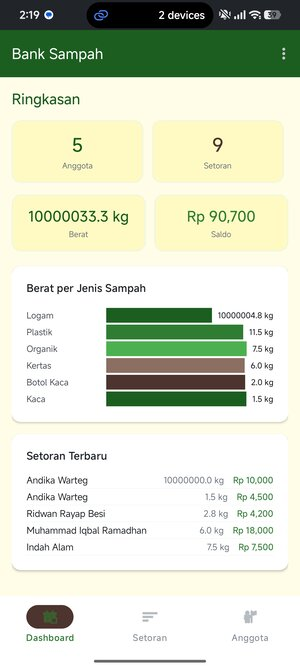
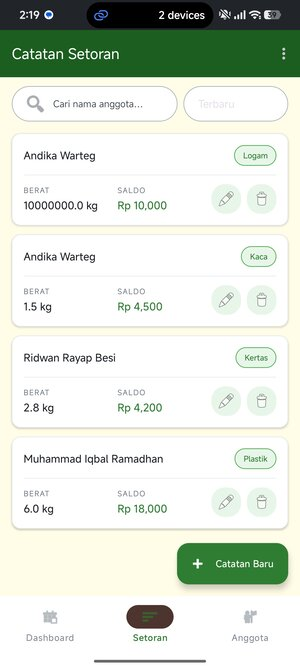
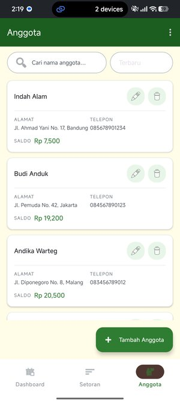
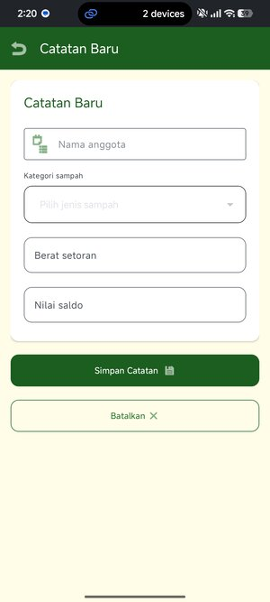
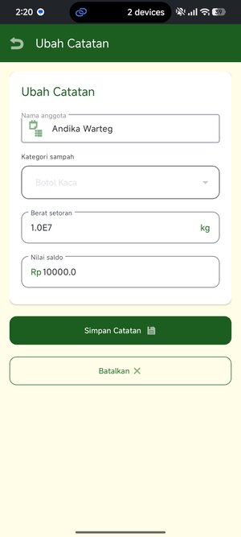
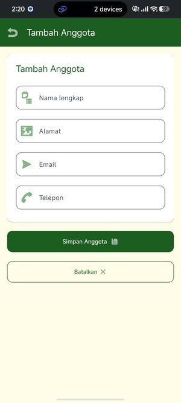
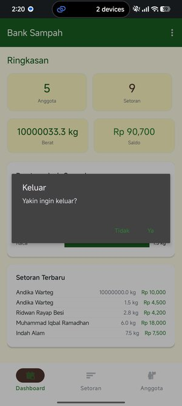

<div align="center">
  <br>
  <h1>🌿 Bank Sampah</h1>
  <p><strong>Aplikasi Pencatatan Setoran Bank Sampah Berbasis Android</strong></p>
  <p>
    Aplikasi untuk mencatat dan mengelola setoran sampah nasabah bank sampah
    <br>
    dengan fitur CRUD, pencarian, pengurutan, dan dashboard statistik.
  </p>
  <br>
  <p>
    
    
    
    
    
  </p>
  <br>
</div>

<p align="center">
  <a href="#fitur">Fitur</a> •
  <a href="#galeri">Galeri</a> •
  <a href="#tech-stack">Tech Stack</a> •
  <a href="#cara-menjalankan">Cara Menjalankan</a> •
  <a href="#struktur-proyek">Struktur</a> •
  <a href="#author">Author</a>
</p>

<br>

<p align="center">
  
</p>

<br>

---

## ✨ Fitur Aplikasi

<table>
<tr>
  <td width="50%" valign="top">
    <h3>🔐 Login & Logout</h3>
    <p>Autentikasi sederhana dengan session yang disimpan di SharedPreferences. Logout dengan konfirmasi dialog.</p>
  </td>
  <td width="50%" valign="top">
    <h3>📊 Dashboard Statistik</h3>
    <p>Ringkasan total anggota, total setoran, total berat, total saldo, dan 5 setoran terbaru. Dilengkapi diagram batang breakdown per jenis sampah.</p>
  </td>
</tr>
<tr>
  <td width="50%" valign="top">
    <h3>📋 CRUD Setoran</h3>
    <p>Tambah, lihat, edit, dan hapus catatan setoran sampah. Dilengkapi autocomplete nama anggota dan spinner jenis sampah.</p>
  </td>
  <td width="50%" valign="top">
    <h3>👥 CRUD Anggota</h3>
    <p>Kelola data anggota bank sampah dengan field nama, alamat, email, telepon, dan tanggal daftar otomatis.</p>
  </td>
</tr>
<tr>
  <td width="50%" valign="top">
    <h3>🔍 Pencarian Real-time</h3>
    <p>Cari setoran atau anggota berdasarkan nama secara instan dengan <code>TextWatcher</code>.</p>
  </td>
  <td width="50%" valign="top">
    <h3>⬆⬇ Sorting Multi-kriteria</h3>
    <p>Urutkan setoran berdasarkan nama, berat, saldo, atau terbaru — ascending maupun descending.</p>
  </td>
</tr>
<tr>
  <td width="50%" valign="top">
    <h3>🌙 Dark Mode</h3>
    <p>Dukungan tema gelap penuh untuk kenyamanan mata saat penggunaan di malam hari.</p>
  </td>
  <td width="50%" valign="top">
    <h3>🎨 Material Design 3</h3>
    <p>Tampilan modern dengan tema hijau hutan, coklat tanah, dan krem — Material Design 3 <em>(Material You)</em>.</p>
  </td>
</tr>
</table>

---

## 🖼️ Galeri Screenshot

<p align="center">
  <em>Klik thumbnail untuk melihat gambar ukuran penuh</em>
</p>

<table>
<tr>
  <td align="center">
    <a href="screenshots/login.jpg">
      
    </a>
    <br>
    <sub>Halaman Login</sub>
  </td>
  <td align="center">
    <a href="screenshots/dashboard.jpg">
      
    </a>
    <br>
    <sub>Dashboard Statistik</sub>
  </td>
</tr>
<tr>
  <td align="center">
    <a href="screenshots/menu-daftar-setoran.jpg">
      
    </a>
    <br>
    <sub>Daftar Setoran</sub>
  </td>
  <td align="center">
    <a href="screenshots/menu-daftar-anggota.jpg">
      
    </a>
    <br>
    <sub>Daftar Anggota</sub>
  </td>
</tr>
<tr>
  <td align="center">
    <a href="screenshots/tambah-setoran.jpg">
      
    </a>
    <br>
    <sub>Tambah Setoran</sub>
  </td>
  <td align="center">
    <a href="screenshots/edit-setoran.jpg">
      
    </a>
    <br>
    <sub>Edit Setoran</sub>
  </td>
</tr>
<tr>
  <td align="center">
    <a href="screenshots/tambah-anggota.jpg">
      
    </a>
    <br>
    <sub>Tambah Anggota</sub>
  </td>
  <td align="center">
    <a href="screenshots/dialog-logout.jpg">
      
    </a>
    <br>
    <sub>Dialog Logout</sub>
  </td>
</tr>
</table>

---

## 🛠️ Tech Stack

<p align="center">
  
  
  
  
  
</p>

| Komponen | Detail |
|----------|--------|
| **Bahasa** | Java |
| **Min SDK** | 29 (Android 10) |
| **Target SDK** | 36 |
| **UI Framework** | Material Design 3 (Material Components for Android) |
| **Database** | SQLite via `SQLiteOpenHelper` |
| **Build System** | Gradle 9.4.1 + AGP 9.2.1 |
| **Architecture** | Single-module, Fragment + BottomNavigationView |
| **State Login** | SharedPreferences |

---

## 🚀 Cara Menjalankan

1. **Clone repositori**
   ```bash
   git clone https://github.com/ArayaMusawwah/Bank-Sampah.git
   ```

2. **Buka di Android Studio**
   - File → Open → Pilih folder `Bank-Sampah`

3. **Sync Gradle**
   - Tunggu Gradle Sync selesai mendownload dependencies

4. **Run aplikasi**
   - Pilih device/emulator (min SDK 29)
   - Klik tombol **Run ▶️**

5. **Login**
   - Username: `admin`
   - Password: `12345`

> **Catatan:** Aplikasi menggunakan SQLite lokal — data akan terisi otomatis dengan sample data saat pertama kali dijalankan.

---

## 📁 Struktur Proyek

```
BankSampah/
├── app/
│   ├── src/
│   │   └── main/
│   │       ├── java/com/mogador/banksampah/
│   │       │   ├── LoginActivity.java          # Halaman login
│   │       │   ├── MainActivity.java           # Host fragment (bottom nav)
│   │       │   ├── DashboardFragment.java      # Dashboard statistik
│   │       │   ├── SetoranFragment.java        # Daftar setoran
│   │       │   ├── AnggotaFragment.java        # Daftar anggota
│   │       │   ├── AddEditSetoranActivity.java # Form tambah/edit setoran
│   │       │   ├── AddEditAnggotaActivity.java # Form tambah/edit anggota
│   │       │   ├── DatabaseHelper.java         # SQLite CRUD
│   │       │   ├── Setoran.java                # Model setoran
│   │       │   ├── Anggota.java                # Model anggota
│   │       │   ├── SetoranAdapter.java         # Adapter RecyclerView setoran
│   │       │   └── AnggotaAdapter.java         # Adapter RecyclerView anggota
│   │       ├── res/
│   │       │   ├── drawable/                   # Shape & ripple drawables
│   │       │   ├── layout/                     # Layout XML
│   │       │   ├── menu/                       # Menu XML
│   │       │   └── values/                     # Tema, warna, string
│   │       └── AndroidManifest.xml
│   └── build.gradle.kts
├── screenshots/                                # Screenshot aplikasi
├── build.gradle.kts                            # Root build
├── settings.gradle.kts
└── gradle/libs.versions.toml                   # Version catalog
```

---

## 👨‍💻 Author

<div align="center">
  <p>
    <strong>Muhammad Iqbal Ramadhan</strong>
    <br>
    NIM: 231011400285
  </p>
  <p>
    <a href="https://github.com/ArayaMusawwah">
      
    </a>
    <a href="https://github.com/ArayaMusawwah/Bank-Sampah">
      
    </a>
  </p>
</div>

---

<div align="center">
  <sub>Dibuat dengan ❤️ untuk tugas akhir mata kuliah Pemrograman Mobile</sub>
  <br>
  <sub>© 2026 Muhammad Iqbal Ramadhan</sub>
</div>
